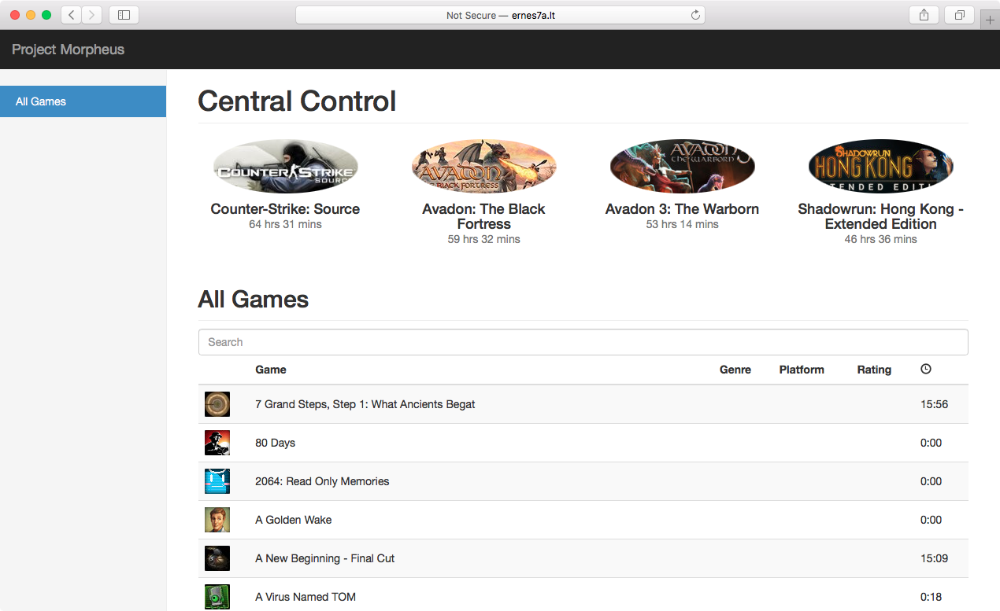

# Project Morpheus

Everything you ever wanted to know about your own Steam game collection.

## Installation

1. In the project directory, run `composer install`
    - if the install fails after message "Generating autoload files": run `mkdir bootstrap/cache && php artisan clear-compiled`
2. Run `php artisan key:generate`
3. Run `chmod -R 777 storage bootstrap/cache`
4. Create a MySQL database to host project data
5. Create an .env file from the env.example file, and add
    - correct MySQL database name and login credentials
    - correct website/Steam user name and login credentials (`ADMIN_*` parameters)
    - set `STEAM_API_KEY` ~ get it from: https://steamcommunity.com/dev
    - set `MASHAPE_API_KEY` ~ get it from: http://docs.mashape.com/api-keys
    - set `APP_KEY` to the output from step #2
6. Run `php artisan migrate:refresh --seed`
7. Go to the project website (the endpoint is `your_project_directory/public`)
8. Log in with your username and password
9. Go to user profile (public/profile)
    - Click on "update gaming data"; this will collect data about the user
10. Run `public/get/store/100` a couple of times; this will collect game metadata

## Authors
**Ernesta Orlovaitė**

+ [ernes7a.lt](http://ernes7a.lt)
+ [@ernes7a](http://twitter.com/ernes7a)

**Aurimas Račas**

+ [aurimas.eu](http://aurimas.eu)
+ [@Aurimas](http://twitter.com/aurimas)

## Screenshot

